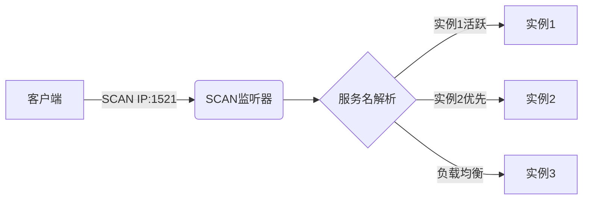

# Service_name

Service_name：该参数是由oracle8i引进的。

服务名=库名  mcdb serviceName
实例 sid orcl    instanceName

一个实例只能对应一个数据库，一个数据库可以用多个实例

## 格式一: Oracle JDBC Thin using a ServiceName:

```
jdbc:oracle:thin:@//<host>:<port>/<service_name>
```

Example:
```
jdbc:oracle:thin:@//192.168.2.1:1521/XE
```

注意这里的格式，@后面有//, 这是与使用SID的主要区别。
这种格式是Oracle 推荐的格式，因为对于集群来说，每个节点的SID 是不一样的，
但是SERVICE_NAME 确可以包含所有节点。

## 格式二: Oracle JDBC Thin using an SID:

```
jdbc:oracle:thin:@<host>:<port>:<SID>
```

Example:
```
jdbc:oracle:thin:@192.168.2.1:1521:X01A
```

Note:
Support for SID is being phased out. Oracle recommends that users switch over to usingservice names.

## 格式三：Oracle JDBC Thin using a TNSName:

```
jdbc:oracle:thin:@<TNSName>
```

Example:
```
jdbc:oracle:thin:@GL
```

Note:
Support for TNSNames was added in the driver release 10.2.0.1

## 架构类型

RAC，即单库多实例
rac+pdb 多库多实例

## catalog schema

servicename 可能是database 也可能是服务名
对于CDB/PDB架构，可以为每个PDB创建独立服务名

## scanip rac 服务名 实例的关系

客户端 → DNS解析SCAN名称 → SCAN监听器 → 服务名解析 → 实际实例



## Oracle版本差异

在Oracle 12c之前，实例与数据库是一对一或多对一的关系。即一个实例只能与一个数据库相关联，数据库可以被多个实例加载  
但在Oracle 12c中，一个实例可以挂载多个数据库，包括CDB及其包含的PDB

所有子节点初始化完成才能 做加解密

