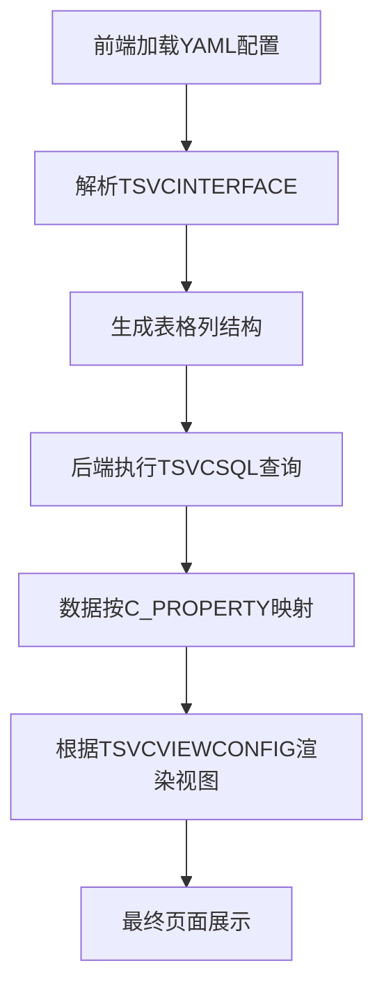

# 

## 概述

配置文件是项目中用于定义前端页面结构的YAML格式配置文件，通过配置化的方式实现页面的动态渲染，无需修改前端代码即可调整页面结构。
里面的sql都是先join成一张临时表 然后在用条件过滤 因为用的是oracle比较可控
如果是mysql并且数据量大的情况下 需要sql调优不方便

## 配置文件结构

### 1. 基础页面信息

```yaml
C_RIGHTCODE: UC_QUERY_ACCOUNTDATAIMPORT  # 功能权限码
C_RIGHTNAME: 记账数据内部接口表查询        # 页面标题/功能名称
C_SYSNAME: INSURANCE-ACCOUNTING         # 系统名称
C_FUNCTIONNO: UC_QUERY_ACCOUNTDATAIMPORT # 功能编号
C_JAVACLASS: commonApi                   # 后端处理类
C_JAVAMETHOD: executeQuery              # 后端处理方法

```

### 2. 数据源定义 (TSVCSQL)

```yaml
TSVCSQL: 
  C_FUNCTIONNO: UC_QUERY_ACCOUNTDATAIMPORT           # 功能编号
  C_SQLSTATEMENT: select t.* from t_accountrecords t order by urid  # SQL查询语句
  C_ORDERBY: null                                    # 排序字段
  C_SQLTYPE: '0'                                     # SQL类型
  C_DATASOURCE: null                                 # 数据源
```

### 3. 字段接口定义 (TSVCINTERFACE)

每个字段定义包含以下属性：

| 属性 | 说明 | 示例 |
|------|------|------|
| C_FIELDNAME | 数据库字段名 | RELATINGCODE |
| C_EXPLAIN | 字段中文说明 | 唯一关联码 |
| C_PROPERTY | 前端属性名 | relatingcode |
| C_FIELDTYPE | 字段类型 | S=字符串, D=日期, F=数字 |
| L_LEN | 字段长度 | 128 |
| L_DECLEN | 小数位数 | 0 |
| C_FLAG | 字段标识 | '1'=输出字段, '0'=查询条件字段 |
| C_FIELDFLAG | 字段标志 | '0'=普通字段, '2'=查询字段 |
| C_NOTNULL | 是否非空 | '0'=可空, '1'=非空 |
| C_CONDITION | 查询条件 | =, in, like等 |
| L_NO | 字段排序号 | 550, 560, 570... |

#### 字段类型说明

- **S**: 字符串类型
- **D**: 日期类型
- **F**: 数字类型（浮点数）
- **I**: 整数类型

#### 字段标识说明

- **C_FLAG='1'**: 输出字段，在查询结果中返回
- **C_FLAG='0'**: 查询条件字段，用于页面查询条件

### 4. 视图配置 (TSVCVIEWCONFIG)

定义字段在前端的显示方式：

| 属性 | 说明 | 示例 |
|------|------|------|
| C_PROPERTY | 对应的字段属性 | urid |
| C_VIEWNAME | 前端显示名称 | 主键ID |
| C_VIEWLEVEL | 显示级别 | '0'=隐藏, '1'=显示 |
| C_VIEWTYPE | 显示类型 | S=文本, D=日期, N=下拉框, F=数字 |
| C_DICNAME | 字典名称 | 用于下拉选项的数据字典 |
| C_BUSINFLAG | 业务标识 | DEFAULT |
| L_NO | 显示顺序 | 10, 20, 30... |
| C_HYPERLINK | 超链接 | 字段是否为超链接 |
| C_EDITTYPE | 编辑类型 | 字段编辑方式 |

#### 显示类型说明

- **S**: 普通文本显示
- **D**: 日期格式显示
- **N**: 下拉框显示（需配合C_DICNAME）
- **F**: 数字格式显示

## 页面渲染流程



### 详细步骤

1. **前端解析YAML** → 根据TSVCINTERFACE生成表格列结构
2. **后端执行SQL** → 使用TSVCSQL中的查询语句获取数据
3. **数据绑定** → 将查询结果按C_PROPERTY映射到前端字段
4. **视图渲染** → 根据TSVCVIEWCONFIG控制字段显示/隐藏和样式

## 配置示例

### 查询页面配置

```yaml
# 基础信息
C_RIGHTCODE: UC_QUERY_ACCOUNTDATAIMPORT
C_RIGHTNAME: 记账数据内部接口表查询
C_JAVACLASS: commonApi 通用接口
C_JAVAMETHOD: executeQuery

# 数据源 复杂sql可以加上@WHERE_REP@片段 使用查询条件整个替换整个位置    
TSVCSQL:
  C_SQLSTATEMENT: select t.* from t_accountrecords t order by urid

# 字段定义
TSVCINTERFACE:
- C_FIELDNAME: URID
  C_EXPLAIN: 主键ID
  C_PROPERTY: urid
  C_FIELDTYPE: S
  C_FLAG: '1'
  L_NO: '560'

# 视图配置
TSVCVIEWCONFIG:
- C_PROPERTY: urid
  C_VIEWNAME: 主键ID
  C_VIEWLEVEL: '0'
  C_VIEWTYPE: S
  L_NO: '10'
```


